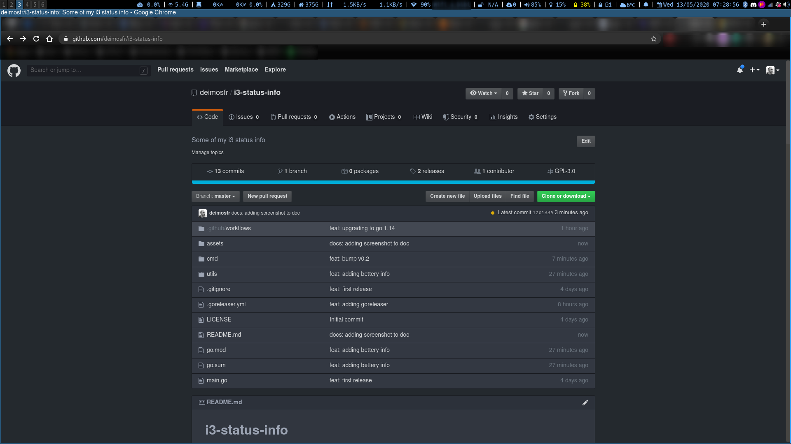

# i3-status-info 

Some of my i3 status info, colored for i3-status-rs and i3blocks, written in Rust.

The main advantages are:
* 1 binary for several usages (disk, cpu, mem, 3D printer...)
* colored output based on custom thresholds
* low memory consumption
* fast



Note: if you want to use `icmp-check`, you will need to set Linux capabilities:
```bash
sudo setcap cap_net_raw=pe /usr/bin/i3-status-info
```

```
$ Usage: i3-status-info [OPTIONS] <COMMAND>

Commands:
  cpu         Get CPU info
  mem         Get Memory info
  perf-mode   Show Performance mode
  disk-io     Get Disk IO info
  disk-usage  Check hostname/ip with port availability
  tcp-check   Check disk usage
  icmp-check  Check hostname/ip availability
  octoprint   Check octoprint job status
  prusa-link  Check PrusaLink job status
  help        Print this message or the help of the given subcommand(s)

Options:
  -o, --output <OUTPUT>  [default: i3-status-rust] [possible values: i3-blocks, i3-status-rust]
  -h, --help             Print help
  -V, --version          Print version
```

```
$ i3-status-info disk-io --help
Get Disk IO info

Usage: i3-status-info disk-io [OPTIONS]

Options:
  -c, --critical <CRITICAL>  [default: 80]
  -w, --warning <WARNING>    [default: 60]
  -d, --display <DISPLAY>    [default: all] [possible values: all, average]
  -h, --help                 Print help
```

# Configuration example

## i3status-rs.toml

```
icons_format = "{icon}"

[theme]
theme = "plain"
[theme.overrides]
idle_fg = "#8bc2ff"
good_fg = "#aaff00"
info_fg = "#8bc2ff"
warning_fg = "#FFA01E"
critical_fg = "#f5737e"

[icons]
icons = "awesome4"

# Performance mode
[[block]]
block = "custom"
command = ''' /usr/bin/i3-status-info perf-mode '''
json = true
interval = 5
merge_with_next = true

# Memory
[[block]]
block = "custom"
command = ''' /usr/bin/i3-status-info mem --warning 70 --critical 90 '''
json = true
interval = 10
format = "󰍛 $text.pango-str()"

# disk io stats
[[block]]
block = "custom"
command = ''' /usr/bin/i3-status-info disk-io '''
json = true
format = " $text.pango-str()"
interval = 5

# Octoprint
[[block]]
block = "custom"
command = ''' /usr/bin/i3-status-info octoprint -u http://x.x.x.x -a your-api-key '''
format = "󰹜 $text.pango-str() "
json = true
hide_when_empty = true
interval = 180
[[block.click]]
button = "right"
cmd = ''' xdg-open http://x.x.x.x '''

# Prusa Link
[[block]]
block = "custom"
command = ''' /usr/bin/i3-status-info prusa-link -u http://x.x.x.x -t your-token '''
format = "$text.pango-str() "
json = true
hide_when_empty = true
interval = 180
[[block.click]]
button = "right"
cmd = ''' xdg-open http://x.x.x.x '''

# xbox status
[[block]]
block = "custom"
command = ''' /usr/bin/i3-status-info icmp-check --ip x.x.x.x --availability-text '''
json = true
format = "$text.pango-str() "
hide_when_empty = true
interval = 60
```


## i3block.conf

Here is an example of the config for i3blocks:

```
color=#8bc2ff
separator=true
separator_block_width=20

[icons]
markup=pango

[cpu]
label=
command=~/.config/i3/i3blocks_bin/i3_status_info cpu
interval=3

[memory]
label=
command=~/.config/i3/i3blocks_bin/i3_status_info mem
interval=10

[disk-slash]
label=
command=~/.config/i3/i3blocks_bin/i3_status_info disk --volumePath /
interval=120

[disk-home]
label=
command=~/.config/i3/i3blocks_bin/i3_status_info disk --volumePath /home
interval=120

[wireless]
label=
command=~/.config/i3/i3blocks_bin/i3_status_info wifi --wifiInterface wlp82s0
interval=10

[battery]
command=~/.config/i3/i3blocks_bin/i3_status_info battery
interval=60
```

# Usage output

If you're using i3status-rs (default), the output will be json output:
```
{"text":"32% 36% 34% 58% 85% 91% 34% 30%","short_text":"32% 36% 34% 58% 85% 91% 34% 30%","state":"Idle"}
```

If you're using i3blocks, the output will be:
```
 18% 10% 08% 26% 12% 100% 06% 10%
18% 10% 08% 26% 12% 100% 06% 10%
Idle
```